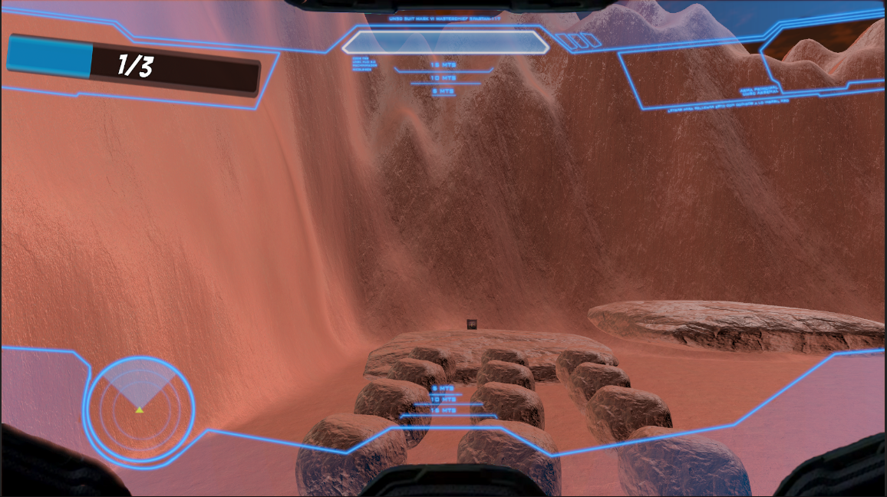

# The Planetary Explorer

## Table of Contents
- [Description](#description)
- [Installation](#installation)
- [Usage](#usage)
- [Editing the Project](#editing-the-project)
- [Visuals](#visuals)
- [Contributing](#contributing)
- [License](#license)
- [Contact](#contact)


## Description
   The Planetary Explorer is a 3D interactive game designed to engage students in exploring alien worlds, specifically exoplanets. This project was developed in response to the challenge of creating innovative and accessible educational materials about exoplanets, aimed at inspiring curiosity and expanding scientific knowledge among students from various backgrounds. 
  
  Players navigate through a simulated environment of Kepler-1649c, overcoming obstacles and challenges while collecting data to learn about the planet's unique properties. By combining entertainment with education, The Planetary Explorer seeks to make complex scientific concepts more approachable and engaging for learners of all ages.

  ### Game Story
  Set a hundred years in the future, an epidemic threatens to make Earth uninhabitable. Humanity must venture beyond the solar system to find a new home, starting with Kepler-1649c, where players simulate the planet’s terrain, gravity, and environment, etc...
  
  ### Gameplay Mechanics
  Players will navigate through various challenges and obstacles, collecting pictures that reveal valuable data about the planet. The game features three stages, each providing players with tools to gather scientific information:
  
  - **Level 1**: Measure the radius of Kepler-1649c and compare it to Earth.
  - **Level 2**: Determine the distance between Kepler-1649c and its star.
  - **Level 3**: Measure the mass of Kepler-1649c.
  
  Upon completing these stages, players will acquire crucial data sourced from NASA, enhancing their understanding of exoplanetary science.


## Installation
  1. **Clone the repository:**
     ```bash
     git clone https://github.com/rasha-2k/The-Planetary-Explorer.git
  2. **Open Unity:**
     - Ensure you have Unity 2020.3.x or higher installed.
     - Launch Unity and select Open Project.
     - Navigate to the folder where you cloned the repository and open it.
  3. **Import Dependencies:**
     - If you encounter any missing packages or assets, Unity will prompt you to install or update them. Simply follow the prompts to import the required dependencies.
   

## Usage
  **To play the game:** You can play the game in two ways:
  
  1. **Using Unity:**
     - Open the project in the Unity Editor.
     - Navigate to `Assets/Scenes` and open one of the scenes (e.g., `MainScene.unity`).
     - Click the **Play** button in the Unity Editor to start the game.
      
  2. **Using the Executable Application:**
     - Navigate to `TheExecutableGame/My project` in your file explorer.
     - Locate the executable file (e.g., `MyProject.exe`).
     - Double-click the executable to run the game. You may need to adjust permissions if prompted.


## Editing the Project
 If you wish to modify or extend the project, follow these steps:
  
  1. **Editing Scripts:**
     - All C# scripts are located in the `Assets/Scripts/` directory.
     - Open any script using the Unity Editor or Visual Studio by double-clicking it from the Project tab.
     - You can modify gameplay mechanics, UI, and other logic directly in the scripts.
  
  2. **Adding New Assets or Scenes:**
     - To add new 3D models, textures, or audio files, place them in the `Assets` folder. Unity will automatically import them.
     - Create new scenes by right-clicking in the Project window and selecting Create > Scene.
  3. **Customizing the Game:**
     - Modify the player controls, game settings, or level designs by editing the respective components in the Inspector window.
     - You can tweak the gravity, player speed, or object interactions to fit your gameplay preferences.


## Visuals

1. 
   *Displays the player in a level with the progress bar visible.*

2. 
   *Shows the help menu activated by pressing the 'H' key, which displays the controls.*

3. 
   *Indicates that a tool has been unlocked, displaying relevant data.*

4. 
   *Shows the player's position box with (x, y, z) dimensions and prompts to activate tools.*

5. 
   *Displays the map with a blue circle marking the player's current position.*

6. 
   *Notifies that a new tool has been unlocked, with instructions for locating it.*


## Contributing
  - Contributions to this project are welcome! If you have suggestions for improvements or new features, follow these steps:
    * Fork the repository.
    * Create a new branch:
      ```bash
      git checkout -b feature-branch
    * Commit your changes
      ```bash
      git commit -m 'Add new feature'
    * Push to the branch
      ```bash
      git push origin feature-branch
    * Open a pull request and provide details about your changes.


## License
  This project is licensed under the MIT License. See the [LICENSE](LICENSE) file for more details.


## Contact
  Rasha Alsaleh - info@rashaalsaleh.com
